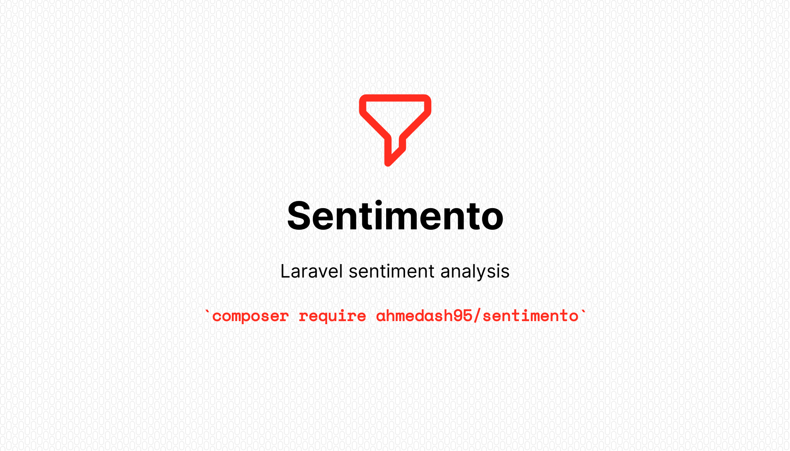

# Sentimento
A laravel package that provides sentiment analysis capabilities using OpenAI's GPT to easily analyze text-based data and gain insight into the underlying sentiment.

<p align="center">
    <p align="center">
        
        <a href="https://github.com/ahmedash95/sentimento/actions"></a>
        <a href="https://packagist.org/packages/ahmedash95/sentimento"></a>
        <a href="https://packagist.org/packages/ahmedash95/sentimento"></a>
        <a href="https://packagist.org/packages/ahmedash95/sentimento"></a>
    </p>
</p>



```php
use Ahmedash95\Sentimento\Facade\Sentimento;

$result = Sentimento::analyze("Food was great!");

$result->value; // Positive
```


## Installation

- First you need to install the package using composer
```bash
composer require ahmedash95/sentimento
```
- (Optional) Publish config file
```bash
php artisan vendor:publish --tag="sentimento-config"
```
- Add your OpenAI API key to your .env file
```bash
SENTIMENTO_OPENAI_TOKEN=sk-xxxxxxxxxxxxxxxxxxxx
```

Now you are ready to use the package

## Usage

OpenAI can comprehend multiple languages, and using it is as easy as invoking a function.

```php
use Ahmedash95\Sentimento\Facade\Sentimento;

Sentimento::analyze("Food was great!"); // Positive

Sentimento::analyze("Food was bad!"); // Negative

Sentimento::analyze("لما اتصلت بالدليفري قالي انه اكل الاوردر"); // Negative
```

⚠️⚠️⚠️ When calling OpenAI to analyze text, there is a possibility that HTTP exceptions may occur if the request to OpenAI fails. This can happen due to a variety of reasons, such as network connectivity issues, server errors, or even rate limiting policies imposed by OpenAI. If the request to OpenAI fails, the package may not be able to properly analyze the sentiment of the given text and may result in unexpected errors or output. To handle this, it is important to catch and handle any potential HTTP exceptions that may occur
```php
use Ahmedash95\Sentimento\Facade\Sentimento;
use Illuminate\Http\Client\RequestException;

try {
    $result = Sentimento::analyze("Food was great!");
} catch (RequestException $e) {
    // $e->getMessage()
}
```

Or you can set the `report_failures` option to `false` in the config file to disable reporting failures
```php
// instead of exception, the result will be Decision::Unknown

$result = Sentimento::analyze("Food was great!"); // Unknown
```
## Testing

```bash
composer test
```

## Contributing
Please feel free to fork this package and contribute by submitting a pull request to enhance the functionalities.

# Credits
- [Ahmed Ammar](https://github.com/ahmedash95)
- [All Contributors](../../contributors)

## License
The MIT License (MIT). Please see [License File](LICENSE) for more information.
